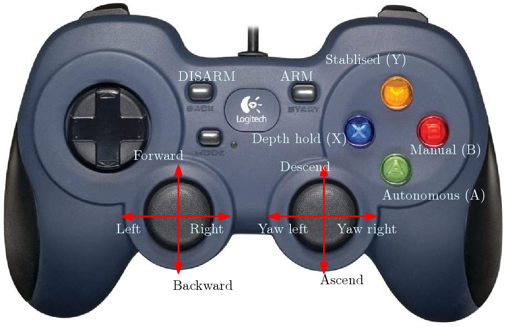
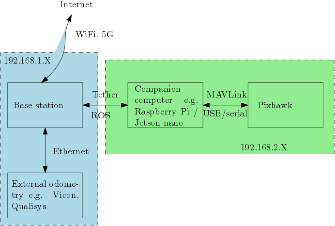

# ORCA_control

## ORCA control packages

High quality ROS package for underwater robotics control and navigation.

## Quality assurance


## Contents

- ROS driver for BlueROV2
- Reconfigurable PID position/velocity controller
- Manual Joystick control
- Offline Git utilities

For more advanced position controllers please refer to ORCA advanced control project. 


## Basic usage
A common use case of this repository is the station keeping and way point following of BlueROV2.
Once the referenced pose (`/pose_ref` by default) and odometry (`/BodyROV01/odom` by default) are provided,
you can launch station keeping mission from `redrov_missions`. 

```bash
roslaunch redrov_missions station_keeping.launch 
```
`ORCA_control` will take over the control of the ROV once `autonomous` mode is enabled. For safety reasons, it is recommended to use joystick to switch to `autonomous` mode by first `ARM` the vehicle and press **A** to initate the station keeping mission.  



At any time, you can press `DISARM` to lock the propellers. Three other modes (depth hold, stablised and manual) allow you to take over the control when you `ARM` the vehicle again. 


## Advanced usage
A more advanced use case is the software and hardware-in-the-loop (HIL) simulation. Pure software simulation is provided as part of the package.
The visulisation requires [UUVsimulator](https://uuvsimulator.github.io/). You can launch it through:

```bash
roslaunch redrov_simulation station_keeping_sim.launch 
```

Manual drive simulation let you get used to the drive of ROV without hardware:
```
roslaunch redrov_simulation manual_sim.launch 
```
Before putting your ROV into the water, you may want to test everything together with your hardware.

```
roslaunch redrov_simulation station_keeping.launch
```


## Handy tools
We provide a couple of useful tools to ease the development and deployment of the control software. 
Check utilities folder for tools to sync time between base computer, offline Git version control and one click software update.
This [blog post](https://blog.tsaoyu.com/articles/offline-git-robot) explains the use of offline git tools in detail.


## Network configuration

The basic assumption on the hardware is that the companinon computer is running ROS and able to communicate with Pixhawk microcontroller.
The network configuration of BlueROV2 is shown in the following figure. Please refer to this [tutorial](http://wiki.ros.org/ROS/NetworkSetup) to setup the network between base computer and BlueROV2. 



On your base computer, the `.bashrc` should at least include the following:

```bash
# ROS main development environment
source /opt/ros/melodic/setup.bash

# ROS custom workspaces
source ~/ORCA_control/redrov/devel/setup.bash

# ROS network settings

export TOP_NAME=laoge
export ROV_NAME=laodi

export ROS_HOSTNAME=laoge
export ROS_MASTER_URI=http://192.168.2.2:11311
```

## Disclaim
The author release the code WITHOUT ANY GUARANTEE. The user takes the sole responsibilities including but not limited to the injure, casualty and other losses.

## Acknowledgement
This work was funded by the EPSRC as part of the UK Robotics and Artificial Intelligence Hub for Offshore Energy Asset Integrity
Management (ORCA-Hub) under grant EP/R026173/1. 
