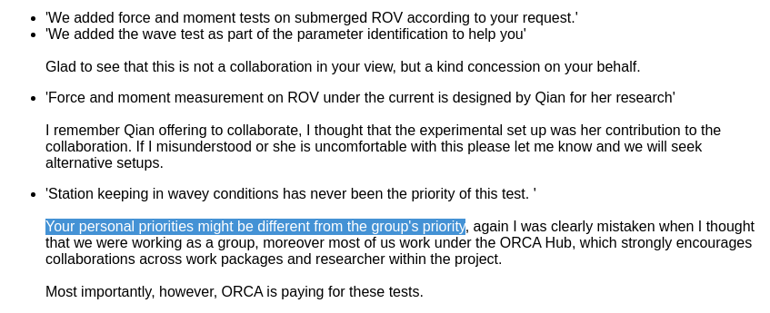
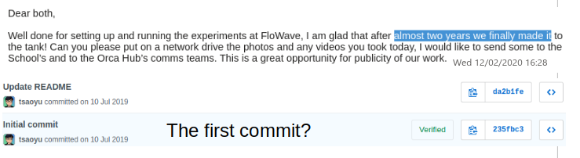

# ORCA_control

## ORCA control packages

High quality ROS package for underwater robotics control and navigation.

## Disciplines

Never write shit code and do shit things.

## Motivations

When you ask someone else kindly to share some code:

When you have been asked to share your data and your code:

Who is wasting the time?

